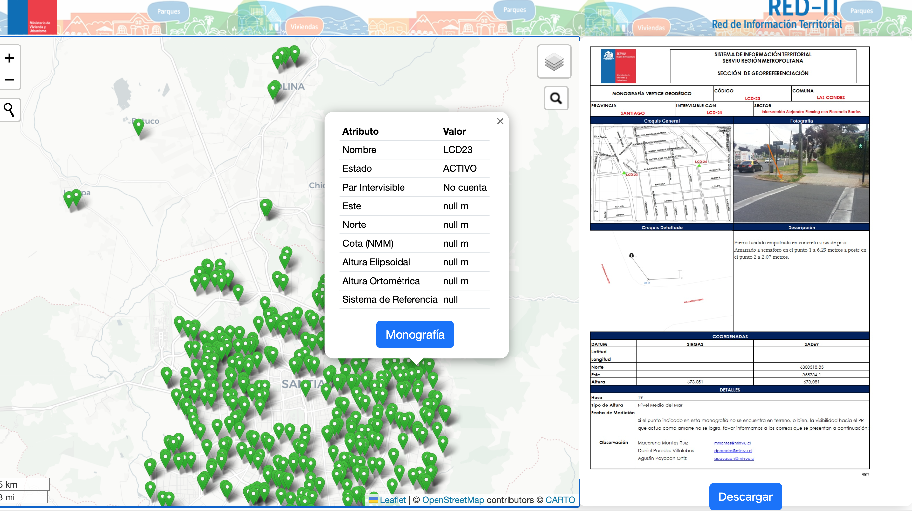
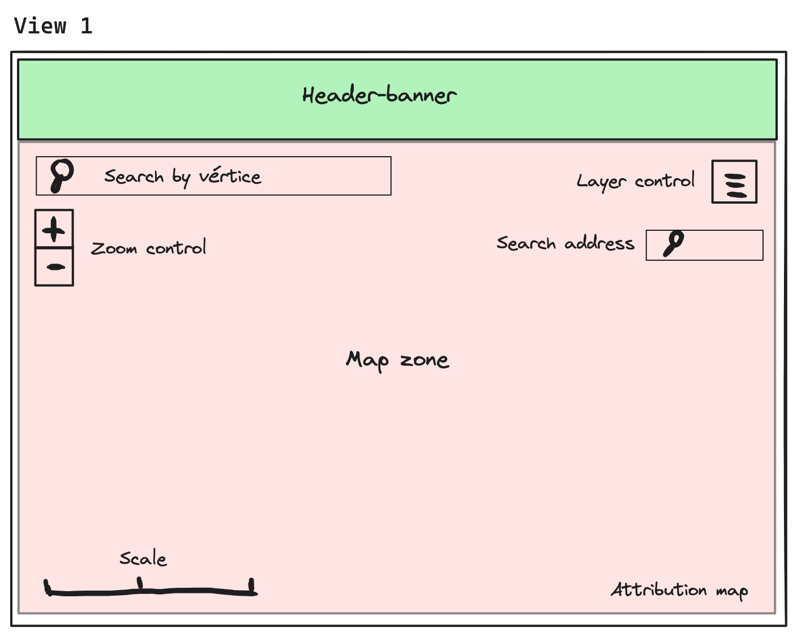
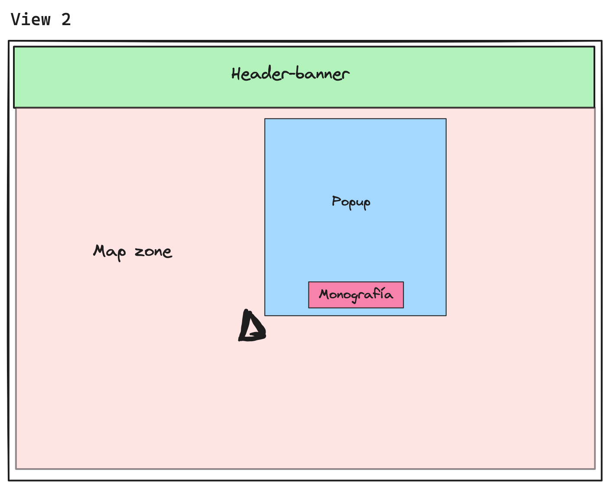
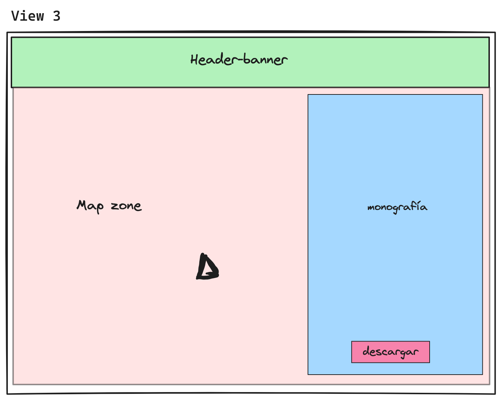

# DESIGN DOC FOR WEBMAP IN REACT-LEAFLET
Link: [Link a este design doc](https://github.com/Denelesan/react-leaflet-red-geodesica/blob/master/design-doc.md)

Author(s): Daniel Paredes Villalobos 

Status: [Draft, Ready for review, ~~In Review~~, Reviewed]

Ultima actualización: 2024-07-13

## Contenido
- Objetivo
- Goals
- Non-Goals
- Background
- Detailed Design
- Solución de Migración Web Map en React-leaflet
- Consideraciones
- Métricas

## Links
- [Repost en GitHub de WebMap en Leaflet](https://github.com/Denelesan/red-geodesica-map-project)
- [Documentación React Dev](https://react.dev/learn/)
- [Documentación Paquete NPM Plugin Geocoder](https://www.npmjs.com/package/leaflet-control-geocoder)
- [Docucmentación Paquete NPM Proj4](https://www.npmjs.com/package/proj4)
- [Documentación Paquete NPM Leaflet Search](hhttps://www.npmjs.com/package/leaflet-search)
- [Ant Design](https://ant.design/components/overview/)

## Objetivo

- Migrar un proyecto de web map realizado en Leaflet a React-leafet, migrando el 100% de sus funcionalidades, plugins, conexiones y diseño web.

- Contar con un webmap realizado en base a un framework como ReactJS, con el fin de, en el futuro, analizar mejoras de funcionamiento aprovechando el manejo de sus estados.

- Poner en práctica lo aprendido sobre react-leaflet.

- Evaluar, al final del proyecto, la continuidad de futuros mapas utilizando React.


## Goals
- Implementar 3 mapas bases.
- Implementar capa espacial de vértices.
- Soportar un control de capas.
- Soportar un popup a cada vértice.
- Soportar desplegar la monografía de cada vértice.
- Implementar un feature que encuentre el vértice más cercano.
- Soportar un buscador de vértices.
- Soportar un buscador de direcciones (geocoding)

## Non-Goals
- Mejorar diseño original.
- _Implementar al seleccionar una comuna, la posibilidad de descargar todas las monografìas (analizar)_
- Optimizar capa consumida desde geoserver.

## Background
- Como equipo, actualmente no disponemos con mapas web que puedan mostrar la información espacial que contamos, es por ello que me encuentro desarrollando distintos mapas web, con el fin de implementar una serie de mapas con funcionalidades y características específicas.
- A raiz de las solicitudes de monografías realizadas por correos, se cree que el mapa de vértices geodésicos es uno de los más necesarios, ya que sería de gran ayuda para los profesionales externos, poniendo a disposición información vértices geodésicos para la vinculación de las labores topográficas y geodésicas de los distintos proyectos de pavimentación en la Región Metropolitana.
- Hace algunos meses, cree un webmap sólo utilizando Leflet y JavaScript,el cual abarcaba todas las funcionalidades requeridas, si bien, este no fue publicado, si fue probado en el servidor web, funcionando sin problemas. 
-  Dado que actualmente estoy usando más React, he decidido aprovechar de implementar un proyecto de mapa web en React-Leaflet.
- La data principal se consume desde un servidor de mapa (_geoserver_), el cual permite conectarse a la data mediante un servicio llamado _Web Feature Services_ (WFS) en tiempo real.



## Detailed Design

En la vista 1, se puede ver la estructura principal del web map.



En la vista 2, se detalla la vista con el popup correspondiente, cuyo interior va un botón que permitirá abrir la monografía del vértice


En la vista 3, se detalla la monografía del vértice seleccionado al costado derecho. En su interior, un botón para descargar la imagen de la monografía.


Los cambios principales:

- Se utilizará para el diseño (IU) la librería de React [ant desing](https://ant.design/)
- Se deberá programar nuevamente el popup para implementar librería de diseñó.
- Crear componentes para la capa principal de data, control layer, popup, monografía, controles de búsqueda (vértices y calles).
- Nuevos plugins que funcionen en React: geocoding, búsqueda y zoom a capa, esto se buscarán en [npm](https://www.npmjs.com) 

 Código que puede ser reusable?:
 - Se reutilizarán las funciones sobre búsqueda de vértice más cercano y fetch para conectar con data en *WFS*.
 - Se reutilizarán los mapas bases (3).
 - Código relativo a los archivos de monografía, se consumirá y descargará de la misma manera que en leaflet.


## Solución de Migración Web Map en React-leaflet
### Fetch a data en WFS
```javascript
function fetchWFSData(url, layerName){
        fetch(url,{
            method:'GET',
            mode: 'cors'
        })
        .then(function(response){
            if(response.status ==200){
                
                return response.json(response)
            } else{
                throw new Error ("Fetch API could not fetch the data")
            }
        })
        .then (function(geojson){
            addWFSData(geojson,layerName)
        })
        .catch(function(error){
            console.log(error)
        })
    }

```
### Función para encontrar vértice más cercano
Se reciclará la misma función utilizada en Leaflet. Analizar mejor o inclusión de un componente:
```javascript 
  var vertexLocationFound;
   var markerVertexLocationFound;
    function findNearestVertex(coord) {
        if(vertexLocationFound){
            vertexLocationFound.remove()
            markerVertexLocationFound.remove()
        }
        var puntoMasCercano = L.GeometryUtil.closestLayer(map, WFSLayer.getLayers(), coord)
        vertexLocationFound = L.circle(puntoMasCercano.latlng, {radius:100})
        console.log(puntoMasCercano)
        markerVertexLocationFound = L.marker(puntoMasCercano.latlng,{icon:L.divIcon({className:'marker-transparent'})})
        var textLocationFound = `<b>${puntoMasCercano.layer.feature.properties.nombre_punto}</b>`
        
        
        markerVertexLocationFound.addTo(map)
        markerVertexLocationFound.bindTooltip(textLocationFound,{ permanent: true, className: "map-label", offset: [20, 0] }).openTooltip()
        vertexLocationFound.addTo(map)
        map.flyTo(puntoMasCercano.latlng, 17)

    }
  

```
### Plugins
#### Buscador de elemento en capa
Existe un plugin en npm para instalar, es el mismo utilizado en leaflet [*Leaflet Control Search*](https://www.npmjs.com/package/leaflet-search) 
```
npm i leaflet-search
```
#### Buscador de direcciones
Se utilizará el plugin [*leaflet-control-geocoder*](https://www.npmjs.com/package/leaflet-control-geocoder), también es la misma librería.
```
npm i leaflet-control-geocoder
``` 

####

## Consideraciones
- Asegurarse de que la carga inicial del mapa no sea demasiado lenta al migrar a React.
- Verificar que la interactividad del mapa (zoom, pan, popups) sea tan fluida como en la implementación original en Leaflet.
- Crear la documentación del proyecto para reflejar los cambios realizados durante la migración, asegurando que otros desarrolladores puedan entender y trabajar con el nuevo código.

## Métricas
- Carga de los 3 basemaps elegidos.
- Tiempo de respuesta del servidor WFS.
- Uso de memoria de la aplicación.


